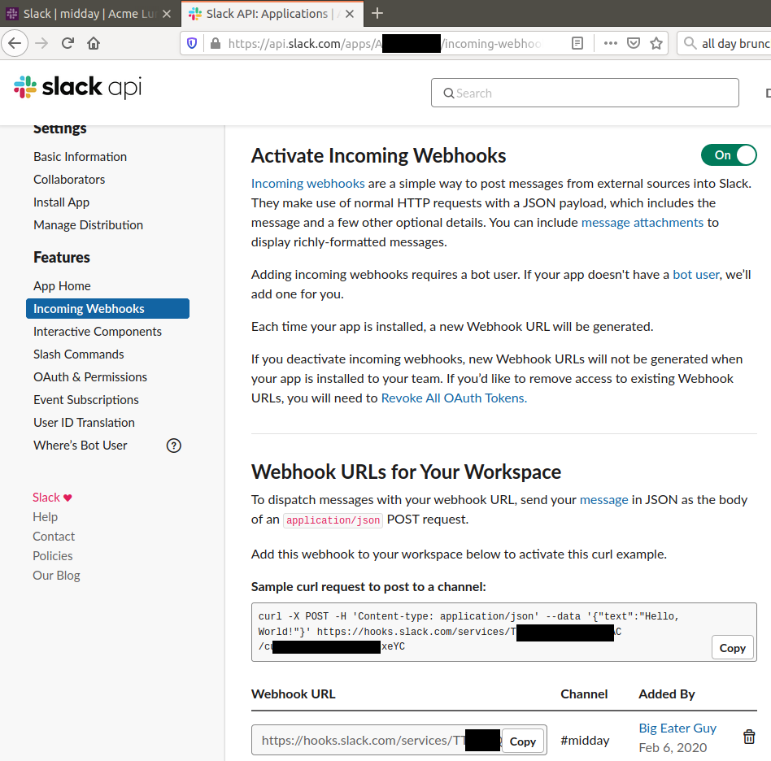

Lunch Polly
===========

*Motivation and Goals*

There's a paid-for lunch every day, but is it appreciated? A feedback
poll can collect positive and negative responses, with optional comments
to say things like "Too spicy for me" or "Not enough :cheese:".
Sometimes there are other meals to be had, and maybe you'd want to poll
about those. Interactions with the poll tool should be easy.

Slack is widely used and easy to interact with. Polly, a paid plugin,
can do many of the things needed, but is vastly overpowered for the
need. Polly, in the free limited mode it doesn't do enough. 

Perfect for a Hack Day project.

*Features Desired*

Votes should be anonymous, but need to be tracked behind the scenes to
prevent double votes (or alternatively, allow votes to change).

Comments should have the option to be anonymous, though obviously you
could sign them. Again, should be tied to user beind the scenes.

People should be able to vote by pushing a button or by using a slash
command.

Votes and comments should be displayed with the original post, and not
spam the channel.

Polls should be short lived, give feedback right away, not next week.

Polls should be trivial to start, so little to no configuration.

Set-Up
------

There's two parts to the set-up, one in Slack and one on the server
hosting the bot.

Firstly in Slack, you need to create a new app:
https://api.slack.com/apps?new_app=1

To get your bot (app) to be able to post stuff into Slack, you need to
create an *incoming webhook*. That's "incoming" from Slack's
perspective.

One really easy way to interact with a bot is through slash commands.
These allow your bot to only respond when summoned, rather than, say,
listening to everything on the channel in realtime.

The slash command will have a "request URL", which is the outgoing (from
Slack's perspective) webhook for sending the commands.

Additionally, and I discovered this rather late in the process, to have
a form with buttons you need to add *Interactivity*. This is another
(or the same if you want, and I did) URL to receive "payloads" from
interactions with messages.

I spent a long time trying to figure out how to add the URL for
interactions to the "blocks" I had which created the buttons.
The "Block Kit Builder" made it fast to create that template:
https://api.slack.com/tools/block-kit-builder

I selected the sample Poll template and modified to suit.

With the Slack side set-up, there's the server side to go. I used an
existing Apache install for the server. To make the CGI happen I used

`ScriptAlias /lunchbot /var/www/slack/lunch`

So that the `/lunchbot` URI would run my `lunch` tool. I also created
and `chown`ed to the Apache user `/var/www/slack/lunch/data.d` (a
directory used to hold lunch poll data, lockfiles, and tmp files for
`curl` commands).

State of the Project
--------------------

Current status of the code: voting and commenting work, but votes never
get displayed. When presenting this hack day project I considered, but
did not make, a joke about following in the footsteps of the February
2020 Iowa Caucus app makers: collect votes accurately, but don't share
them.

There's something wrong with how I'm creating / sending the update
message. What I *want* to happen is `show_updates()` will rebuild the
blocks JSON with all the votes data and then edit the message in-place
in the Slack channel. I'm undecided if comments should be included in
the block or seperate in a thread, currently it includes them. What
*actually* happens is updates disappear into the void.

Speaking of "void", button pushes send a payload and that gets
processed, but the response from the button push to the user never shows
up. Maybe that sort of event is not supposed to send an ephemeral
response? But that combined with `show_updates()` not working is very
unsatisfactory.

There's probably someway to find the `ts` of a message before a button
push event happens, but I don't know it. To Slack `channel_id` + `ts`
seems to uniquely identify a message. Perhaps after posting to a
channel, check that channel's history looking for the message and it's
`ts` there?

Things Learned
--------------

* Writing a Slack bot to process `/slash` commands is super easy.
* Writing a Slack bot that just posts messages to a channel is super easy.
* Writing a Slack bot that uses the blocks method to build complex posts is not hard (but maybe not super easy).
* Writing a Slack bot that updates an existing message with vote data has a subtle craftiness to it.
